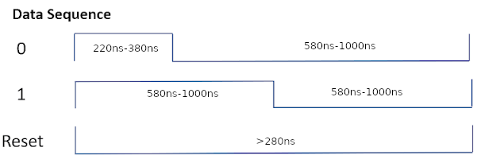

# Audio Light Show

This README shows the functionality behind a real-time audio processing light show built in the most efficient way possible on a PIC18-Q71 - 90% of the functionality runs on the MCU without using the CPU through various core-independent peripherals (CIPs).

The PIC18-Q71's on-chip analog consisting of [OP-AMP](https://www.microchip.com/en-us/products/microcontrollers-and-microprocessors/8-bit-mcus/core-independent-and-analog-peripherals/integrated-analog/operational-amplifier) and [ADC](https://www.microchip.com/en-us/products/microcontrollers-and-microprocessors/8-bit-mcus/core-independent-and-analog-peripherals/integrated-analog/analog-to-digital-converter) modules measure the incoming analog frequencies then use [DMA](https://www.microchip.com/en-us/products/microcontrollers-and-microprocessors/8-bit-mcus/core-independent-and-analog-peripherals/system-flexibility/direct-memory-access) to transfer the readings into the [UART/DMX](https://www.microchip.com/en-us/products/microcontrollers-and-microprocessors/8-bit-mcus/core-independent-and-analog-peripherals/communication-connectivity-peripherals/uart-peripherals) module to transmmit to the receivers. Each receiver is connected in a daisy-chain fashion through ethernet cables where the receiver also uses a PIC18-Q71 to receive the DMX data and to drive WS2812 LEDs through its [SPI](https://www.microchip.com/en-us/products/microcontrollers-and-microprocessors/8-bit-mcus/core-independent-and-analog-peripherals/communication-connectivity-peripherals/spi-peripherals) module.

The first GIF shows 7 receivers responding to music, and the second one shows a standby effect. The transmitter has an aux cable plugged in off-screen.

## Related Documentation

- [PIC18-Q71 Datasheet](https://ww1.microchip.com/downloads/aemDocuments/documents/MCU08/ProductDocuments/DataSheets/PIC18F26-46-56Q71-Microcontroller-Data-Sheet-DS40002329.pdf)
- Setting up DMX with DMA on a PIC18: [TB3204 - DMX-512 using the UART with Protocol Support](https://ww1.microchip.com/downloads/en/Appnotes/TB3204-DMX-512-using-UART-90003204A.pdf)
- Development tools documentation: [PIC18F57Q84 Curiosity Nano Hardware User Guide](https://ww1.microchip.com/downloads/en/DeviceDoc/PIC18F57Q84-Curiosity-Nano-Hardware-User-Guide-DS50003011.pdf)
- Voltage Converter datasheet: [MIC28517 Datasheet](https://ww1.microchip.com/downloads/aemDocuments/documents/APID/ProductDocuments/DataSheets/MIC28517-Data-Sheet-DS20006317C.pdf)

## Software Used

- MPLAB® X IDE 6.1.0 or newer [(MPLAB® X IDE 6.1)](https://www.microchip.com/en-us/development-tools-tools-and-software/mplab-x-ide?utm_source=GitHub&utm_medium=TextLink&utm_campaign=MCU8_MMTCha_MPAE_Examples&utm_content=pic16f56q71-dmx-light-show-github)
- MPLAB XC8 2.41.0 or newer compiler [(MPLAB® XC8 2.41)](https://www.microchip.com/en-us/development-tools-tools-and-software/mplab-xc-compilers?utm_source=GitHub&utm_medium=TextLink&utm_campaign=MCU8_MMTCha_MPAE_Examples&utm_content=pic16f56q71-dmx-light-show-github)
- MPLAB Code Configurator (MCC) 3.95.0 or newer [(MCC)](https://www.microchip.com/mplab/mplab-code-configurator)

## Setup

To use the demo, connect all transmitters and receivers with an ethernet cable. Power up the transmitter with a 48V power supply, and connect an AUX cable to watch the incoming audio signal come to life.

Each receiver is selectively listening to DMX data on the line. A DIP switch on each receiver indicates its node number, and it's position in the chain.

Apart from the final transmitter and receiver boards, shown in the initial gif are 3D printed stands to mount the receiver boards, as well as diffusing tubes. The tubes are made of WS2812 LEDs taped to an aluminum strip for support. Then, parchment paper is taped inside a florescent tube guard and a 3D printed cap holds the aluminum strip towards the back of the tube for maximum LED diffusion.

## Theory of Operation

This demo can be broken up into 3 portions:
1. [Audio Signal Processing](#audio-signal-processing)
2. [DMX data](#dmx-data)
3. [Driving the WS2812 LEDs](#driving-the-ws2812-leds)

The beauty of this project is that nearly all of this demo operates without the CPU - it uses CIPs to acquire and DMA to move the data around. The only thing running on the CPU is the manually programmed visual effects to convert the audio signal into LED data.

### Audio signal processing
To get the initial audio data, this project extracts bins of audio frequencies and then does peak detection on each bin giving a value of how intense that audio frequency is. Each peak is then displayed on a different LED tube. To acquire these audio frequency bins, analog bandpass filters can be used for each desired frequency. To reduce the number of needed passive components, an MSGEQ7 chip was used. This chip functions as a bandpass filter, multiplexing between frequencies. The Q71 drives the chip to change where the center frequency is and then uses its onboard analog to sample the peak. The Q71's OP-AMP is used in unity-gain mode to impedance match the output, then the ADC is used to acquire the output peak.

### DMX Data
DMX512, or DMX for short, is an industry-standard protocol commonly used to control stage lighting and theatrical effects that enables centralized control of multiple devices from a single controller. Devices in a DMX network are daisy-chained together creating a "DMX universe". Within each universe, each node listens to the start code and specific data bytes out of the 512 bytes in each packet.

For this DMX light show, each node listens to 3 bytes and the start code. Depending on the start code, the nodes interpret their 3 bytes differently, giving DMX flexibility on the fly.

 
| Start Code | Mode | Byte 1 | Byte 2 | Byte 3 |
| ---- | ---- | ---- | ---- | ---- |
| 2 | Reactive | G Led Data  | R Led Data | B Led Data |
| 3 | Visualizer | # of Leds to Turn On | Color Change Threshold 1 | Color Change Threshold 2 |

 When `Start Code = 2`, each byte represents the entire tube's RGB data. So, for DMX receiver 1, when the data is as shown above `G = 255, R = 0, B = 0`, the tube looks like the left-most picture. When `Start Code = 3`, the interpretation of the data changes as shown and the tube for receiver 1 change to the right-most picture.

DMX provides the needed structure for fast and flexible data. The PIC18-Q71 compliments DMX by allowing the data's meaning to be changed based on I/O - toggling a switch changes the start code, and thus how the data is interpreted.

### Driving the WS2812 LEDs
After the DMX data has been received, WS2812 LEDs change to reflect the incoming data. WS2812 LEDs are programmable through a special 1-wire protocol. The LEDs are daisy-chained together, similar to the DMX protocol, but instead, each LED receives all the data, strips off its portion, and sends the data onward. The data for each LED consists of 1 byte for G, R, and B data respectively (for a total of 3 bytes).

To drive the WS2812 protocol, the microcontroller pulls a line high or low for different amounts of time:

This requires an I/O line to be changed every 220ns, or at least 4.5 Million times per second requiring 4.5Mhz of processing power. This could create a processing bottleneck in time-sensitive applications. Alternatively, the PIC18-Q71's hardware SPI module can creatively drives the WS2812 protocol, so the MCU simply needs to load the SPI buffer with multiple data bytes instead of individually driving each bit.

It does this by chaining the SPI module with the PWM and CLC CIPs to create a serial output exactly like the WS2812 protocol needs.

## Development Hardware Used

For a large-scale project that shows many moving parts working together, it helps to first set up using easy-to-use hardware, then transition to something more polished and stable.

This project was first set up using [Curiosity Development Boards](https://www.microchip.com/en-us/tools-resources/evaluation-boards/curiosity) and jumper wires. Curiosity Development Boards feature an onboard programmer so only a USB cable was needed to program each Q71. As the features were developed and the hardware requirements stopped changing, the project was transitioned to dedicated PCBs. Below is the main hardware used to spool up a prototype.

- PIC18F56Q71 Curiosity Nano [EV01G21A](https://www.microchip.com/en-us/development-tool/EV01G21A)
- Curiosity Nano Base for Click Boards™ [AC164162](https://www.microchip.com/en-us/development-tool/ac164162)
- [MSGEQ7](https://www.sparkfun.com/products/10468)
- [WS2812 LED Strip](https://www.amazon.com/BTF-LIGHTING-Waterproof-Flexible-Individually-Addressable/dp/B01CDTEEZ2/)

The perf board held the supporting circuitry for the MSGEQ7 to acquire the analog signal. After the analog signal was acquired, a single-ended signal transmitted the DMX data to the receiver board which drive the WS2812 LED as shown on the left. One other notable point is the Curiosity Nanos all needed to connect to A/C power, greatly limiting the decentralized nature of the daisy-chained DMX protocol.

The final design was built on PCBs that encoded the DMX signal per the DMX specification, using RS-485 differential signaling for signal integrity up to 4,000 feet. Also, instead of using XLR cables for the DMX signal, ethernet cables were used, enabling PoE to be run through the same cable, eliminating the central power source requirement. This allows only 1 connection to a power source and large cable runs for the demo to be set up across a stage or even a room - perfect for traveling musicians who need to set up and tear down their equipment quickly.

## Final Hardware Used

### The Transmitter
The transmitter was built on a custom 4-layer PCB. All parts used are in the [Transmitter Bill of Materials](./PCBs/DMX%20Transmitter/dmxTxBOM.csv) in the repo as well as the [files to have the boards manufactured](./PCBs/DMX%20Transmitter/dmxTx-Outputs.zip). Just like the prototype hardware, the audio signal comes in and the Q71 processes it and sends out DMX data, but this time, it does so on an ethernet cable. As noted above, passive PoE was implemented so a 48V power source is used and a MIC28517 buck converter steps down the voltage to the MCU's required 5 volts.

Notable parts in each of the section of the board:

**Analog In:** The [MSGEQ7](https://www.sparkfun.com/products/10468) extracts the amplitudes of 7 frequency bands from an audio signal to be displayed.

**PIC18-Q71:** The [PIC18-Q71](https://www.microchip.com/en-us/products/microcontrollers-and-microprocessors/8-bit-mcus/pic-mcus/pic18-q71) drives and reads the MSGEQ7's output by first matching the analog impedance using its on-chip OP AMP as a unity gain buffer, then sampling the signal using its ADC. It then sends out lighting data to each of the receiver nodes over DMX.

**48 to 5V:** The [MIC28517](https://www.microchip.com/en-us/product/mic28517) was chosen since it can handle the 48V requirements of PoE while providing up to 8A. Each receiver node needs up to 1.5A for the WS2812 LEDs, so this chip gives us plenty of overhead.

**SP485:** Marked U3 on the schematic this chip converts the outgoing DMX signal into a differential pair (RS-485) for increased signal distance.

### The Receivers
Receiver [Bill of Materials](./PCBs/DMX%20Receiver/dmxRx.csv) and [board files](./PCBs/DMX%20Receiver/dmxRx-v2Outputs.zip)
The ethernet connectors on either side pass through the power and DMX signals to continue the daisy chain. The Q71 on each receiver takes the DMX data in and then appropriately drives WS2812 LEDs using its CIPs. Each receiver is programmed using a PICKIT5 programmer as opposed to the onboard PkoB programmer on the Curiosity Nanos used during development.

## Summary
This README covered the theory and functional implementation of a real-time audio light show using the PIC18-Q71. It provides the foundation for scaling this idea into a full-scale application or modifying it for your needs.
