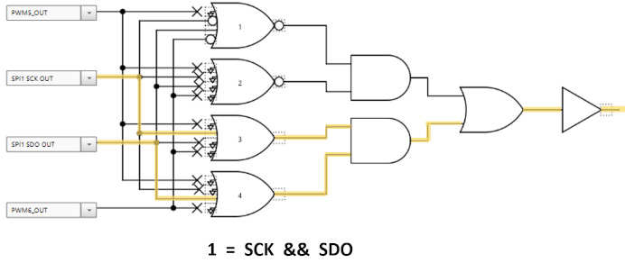
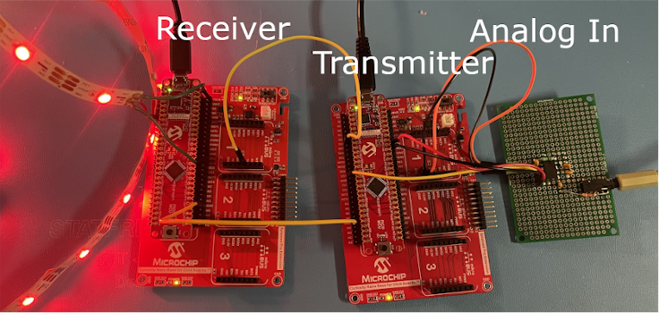
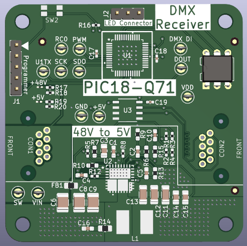

# Audio Light Show Using PIC18-Q71

This project shows the functionality behind a real-time audio processing light show built extremely efficiently on a PIC18-Q71 microcontroller (MCU). 90% of the functionality runs on the MCU without engaging the CPU through the use of various Core-Independent Peripherals (CIPs).

The PIC18-Q71 on-chip analog, consisting of the Operational Amplifier ([OPA](https://www.microchip.com/en-us/products/microcontrollers-and-microprocessors/8-bit-mcus/core-independent-and-analog-peripherals/integrated-analog/operational-amplifier)) and Analog-to-Digital Converter ([ADC](https://www.microchip.com/en-us/products/microcontrollers-and-microprocessors/8-bit-mcus/core-independent-and-analog-peripherals/integrated-analog/analog-to-digital-converter)) modules, measure the incoming analog frequencies and use Direct Memory Access ([DMA](https://www.microchip.com/en-us/products/microcontrollers-and-microprocessors/8-bit-mcus/core-independent-and-analog-peripherals/system-flexibility/direct-memory-access)) to transfer the readings into the Universal Asynchronous Receiver and Transmitter ([UART](https://www.microchip.com/en-us/products/microcontrollers-and-microprocessors/8-bit-mcus/core-independent-and-analog-peripherals/communication-connectivity-peripherals/uart-peripherals))/[DMX512](https://www.microchip.com/en-us/products/microcontrollers-and-microprocessors/8-bit-mcus/core-independent-and-analog-peripherals/communication-connectivity-peripherals/uart-peripherals) module to transmit to the receivers. Each receiver also uses a PIC18-Q71 to receive the DMX data and then appropriately drives WS2812 LEDs through its Serial Peripherals Interface ([SPI](https://www.microchip.com/en-us/products/microcontrollers-and-microprocessors/8-bit-mcus/core-independent-and-analog-peripherals/communication-connectivity-peripherals/spi-peripherals)) module. The receivers are daisy-chained through ethernet cables that transfer both data and power.

The first image below displays seven receviers responding to music, while the other one shows a standby effect. The transmitter has an AUX cable plugged in off-screen.

## Related Documentation

- [PIC18-Q71 Data Sheet](https://ww1.microchip.com/downloads/aemDocuments/documents/MCU08/ProductDocuments/DataSheets/PIC18F26-46-56Q71-Microcontroller-Data-Sheet-DS40002329.pdf)
- [TB3204 - DMX-512 using the UART with Protocol Support](https://ww1.microchip.com/downloads/en/Appnotes/TB3204-DMX-512-using-UART-90003204A.pdf) - Setting up DMX with DMA on a PIC18
- [PIC18F56Q71 Curiosity Nano Hardware User Guide](https://ww1.microchip.com/downloads/aemDocuments/documents/MCU08/ProductDocuments/UserGuides/PIC18F56Q71-CuriosityNano-HW-UG-DS50003481.pdf) - Development tools documentation
- [MIC28517 Data Sheet](https://ww1.microchip.com/downloads/aemDocuments/documents/APID/ProductDocuments/DataSheets/MIC28517-Data-Sheet-DS20006317C.pdf) - Voltage Converter Data Sheet 

## Software Used

- [MPLAB® X IDE 6.1.5](https://www.microchip.com/en-us/development-tools-tools-and-software/mplab-x-ide?utm_source=GitHub&utm_medium=TextLink&utm_campaign=MCU8_MMTCha_MPAE_Examples&utm_content=pic16f56q71-dmx-light-show-github) or newer
- [MPLAB XC8 2.45.0](https://www.microchip.com/en-us/development-tools-tools-and-software/mplab-xc-compilers?utm_source=GitHub&utm_medium=TextLink&utm_campaign=MCU8_MMTCha_MPAE_Examples&utm_content=pic16f56q71-dmx-light-show-github) or newer
- [MPLAB Code Configurator (MCC) 3.95.0](https://www.microchip.com/mplab/mplab-code-configurator) or newer

## Setup

To operate the demo, connect all the transmitters and receivers with an Ethernet cable. Power up the transmitter with a 48V power supply and connect an AUX cable to watch the incoming audio signal come to life. Each receiver is selectively listening to specific DMX data. A DIP switch on each receiver dictates what incoming DMX data to listen to, effectively defining a node number.

Apart from the final transmitter and receiver boards shown in the initial image representations, 3D printed stands are also shown which are used to mount the receiver boards and the diffusing tubes. The diffusing tubes consist of WS2812 LEDs taped to an aluminum strip for support. Inside the fluorescent tube guard, parchment paper lines the interiors and a 3D printed cap securely holds the aluminum strip towards the back of the tube ensuring optimal LED diffusion.

## Theory of Operation

This demo can be broken up into three portions:
* [Audio Signal Processing](#audio-signal-processing)
* [DMX Data](#dmx-data)
* [Driving the WS2812 LEDs](#driving-the-ws2812-leds)

The distinguishing feature of this project is nearly all of this demo operates without the CPU, and instead using CIPs and the DMA. The CPU's sole task is to run the manually programmed visual effects that convert the acquired frequency data into LED data.

### Audio Signal Processing
To obtain the initial audio data, this project extracts bins of audio frequencies and performs peak detection on each bin giving a value corresponding to the intensity of the audio frequency. Each peak is then visually represented on a different LED tube.

Source: [MSGEQ7 data sheet](https://www.sparkfun.com/datasheets/Components/General/MSGEQ7.pdf)

To extract and acquire these audio frequency bins, analog bandpass filters with an ADC can be used for each desired frequency. Alternatively, an MSGEQ7 chip was used to reduce the number of needed passive components. This chip functions as a bandpass filter, multiplexing between frequencies. The PIC18-Q71 drives the chip to change where the center frequency is and then uses its on-board ADC to sample the peak. The PIC18-Q71's OPA is used in Unity Gain mode to impedance match the output, then the ADC with computation is used to acquire the output peak.

By using the OPA in Unity Gain mode, a buffer is created that ensures the ADC can read the analog signal without affecting it. If the input from the filters is of high impedance, the ADC may not read the result accurately. By using the OPA as a buffer, this ensures the ADC can always read the signal accurately and without affecting the original signal. Also, the ADC has built-in computation that provides an automatic average of readings to eliminate potential outliers, providing a more accurate reading.

### DMX Data
DMX512, or DMX for short, is an industry-standard protocol commonly used to control stage lighting and theatrical effects, providing centralized control of multiple devices from a single controller. Devices in a DMX network are daisy-chained together creating a "DMX universe". Within each universe, each node listens to the start code and specific data bytes out of the 512 bytes in each packet.

For this DMX light show, each node listens to 3 bytes and the start code. Depending on the start code, the nodes interpret their three bytes differently, giving DMX flexibility on the fly.

 
| Start Code | Mode | Byte 1 | Byte 2 | Byte 3 |
| ---- | ---- | ---- | ---- | ---- |
| 2 | Reactive | G LED Data  | R LED Data | B LED Data |
| 3 | Visualizer | # of LEDs to Turn On | Color Change Threshold 1 | Color Change Threshold 2 |

 When `Start Code = 2`, each byte represents the entire tube's RGB data. For the first receiver, when `Start Code = 2` and the data are as shown above (`G = 255, R = 0, B = 0`), the tube looks like in the left image. When `Start Code = 3`, the data interpretation is altered to the table below and the tube for receiver 1 changes to what is shown in the image on the right.
 

DMX provides the needed structure for fast and flexible data. The PIC18-Q71 compliments DMX by allowing the data's meaning to be changed based on Input/Output (I/O). The data interpretation is changed by toggling a switch, which changes the start code.

### Driving the WS2812 LEDs
After the DMX data has been received, the WS2812 LEDs change to reflect the incoming data. WS2812 LEDs are programmable through a 1-Wire protocol. The LEDs are daisy-chained together, similar to the DMX protocol, but each LED receives all the data, strips off its portion, and sends the data onward. The data for each LED consists of one byte for G, R, and B data respectively (for a total of three bytes).

To drive the WS2812 protocol, the microcontroller pulls a line high or low for different amounts of time:

This requires an I/O line to be changed every 220 ns or at least 4.5 million times per second requiring 4.5 Mhz of processing power. This could create a processing bottleneck in time-sensitive applications. Alternatively, the SPI module of the PIC18-Q71 device family can creatively drive the WS2812 protocol in hardware, so that the MCU simply needs to load the SPI buffer with multiple data bytes instead of individually driving each bit. This is done by chaining the SPI module with the PWM and Configurable Logic Cell (CLC) CIPs to create the serial output needed by the WS2812 protocol.

*SPI + PWM + CLC Waveform*

Implementation with CLC's - Generating 0's

Implementation with CLC's - Generating 1's

## Development Hardware Used

For a large-scale project that shows many moving parts working together, it helps to first set up using easy-to-use hardware, then transition to something more polished and stable.

This project was first set up using [Curiosity Development boards](https://www.microchip.com/en-us/tools-resources/evaluation-boards/curiosity) and jumper wires. Curiosity Development boards feature an on-board programmer, meaning that only a USB cable was needed to program each PIC18-Q71. As the features were developed and the hardware requirements stopped changing, the project was transitioned to dedicated PCBs. Below is the main hardware used for the initial prototype.

- PIC18F56Q71 Curiosity Nano ([EV01G21A](https://www.microchip.com/en-us/development-tool/EV01G21A))
- Curiosity Nano Base for Click Boards™ ([AC164162](https://www.microchip.com/en-us/development-tool/ac164162))
- [MSGEQ7 Graphic Equalizer Display Filter](https://www.sparkfun.com/products/10468)
- [WS2812 LED Strip](https://www.amazon.com/BTF-LIGHTING-Waterproof-Flexible-Individually-Addressable/dp/B01CDTEEZ2/)

The perfboard held the supporting circuitry for the MSGEQ7 to acquire the analog signal. After the analog signal was acquired, a single-ended signal transmitted the DMX data to the receiver board which drive the WS2812 LED, as shown on the left. One other notable point is the Curiosity Nanos all needed to connect to A/C power, greatly limiting the decentralized nature of the daisy-chained DMX protocol. The PIC18F56Q71 was used since it is the family variation used on the Curiosity Nano boards, but any PIC18-Q71 can be used for the project, provided the pin output settings were changed in the code.

The final design was built on PCBs that encoded the DMX signal per the DMX specification, using RS-485 differential signaling for signal integrity of up to 4,000 feet. Also, instead of using XLR cables for the DMX signal, Ethernet cables were used, enabling Power over Ethernet (PoE) to be run through the same cable, eliminating the central power source requirement. This allows only one connection to a power source and large cable runs for the demo to be set up across a stage or even a room - perfect for traveling musicians who need to set up and tear down their equipment quickly.

## Final Hardware Used

- [MPLAB PICkit™ 5 In-Circuit Debugger](https://www.microchip.com/en-us/development-tool/pg164150)

### The Transmitter
The transmitter was built on a custom 4-layer PCB. All parts used are in the [Transmitter Bill of Materials](./PCBs/DMX%20Transmitter/dmxTxBOM.csv) in this repository, as well as all of the corresponding [files needed to have the boards manufactured](./PCBs/DMX%20Transmitter/dmxTx-Outputs.zip). Similar to the prototype hardware, the audio signal comes in and the PIC18-Q71 processes it and sends out the DMX data, but this time, it does so on an Ethernet cable. As noted above, passive PoE was implemented so a 48V power source is used and a MIC28517 buck converter steps down the voltage to the MCU's required five volts.

Notable parts in each of the section of the board:

## Analog In
 The [MSGEQ7](https://www.sparkfun.com/products/10468) extracts the amplitudes of seven frequency bands from an audio signal to be displayed.

## PIC18-Q71
The [PIC18-Q71](https://www.microchip.com/en-us/products/microcontrollers-and-microprocessors/8-bit-mcus/pic-mcus/pic18-q71) drives and reads the MSGEQ7 output by first matching the analog impedance using its on-chip OPA as a unity gain buffer, then sampling the signal using its ADC. It then sends out lighting data to each of the receiver nodes over DMX.

## 48 to 5V
The [MIC28517](https://www.microchip.com/en-us/product/mic28517) was chosen since it can handle the 48V requirements of PoE while providing up to 8A. Each receiver node needs up to 1.5A for the WS2812 LEDs, so this chip gives us plenty of overhead.

## SP485
This chip converts the outgoing DMX signal into a differential pair (RS-485) for increased signal distance (U3 on schematic).

### The Receivers
The receiver [Bill of Materials](./PCBs/DMX%20Receiver/dmxRx.csv) and [board files](./PCBs/DMX%20Receiver/dmxRx-v2Outputs.zip) are included in this repository. The receivers function the same as in the prototype, but have Ethernet connectors on either side pass through the power and DMX signals to continue the daisy chain. The PIC18-Q71 on each receiver takes the DMX data in and then appropriately drives the WS2812 LEDs using its CIPs. Each receiver is programmed using a PICkit™ 5 programmer, as opposed to the on-board PKOB programmer on the Curiosity Nanos used during development.

## Summary
This project covered the theory and functional implementation of a real-time audio light show using the PIC18-Q71. It provides the foundation for scaling this idea into a full-scale application or modifying it as needed.